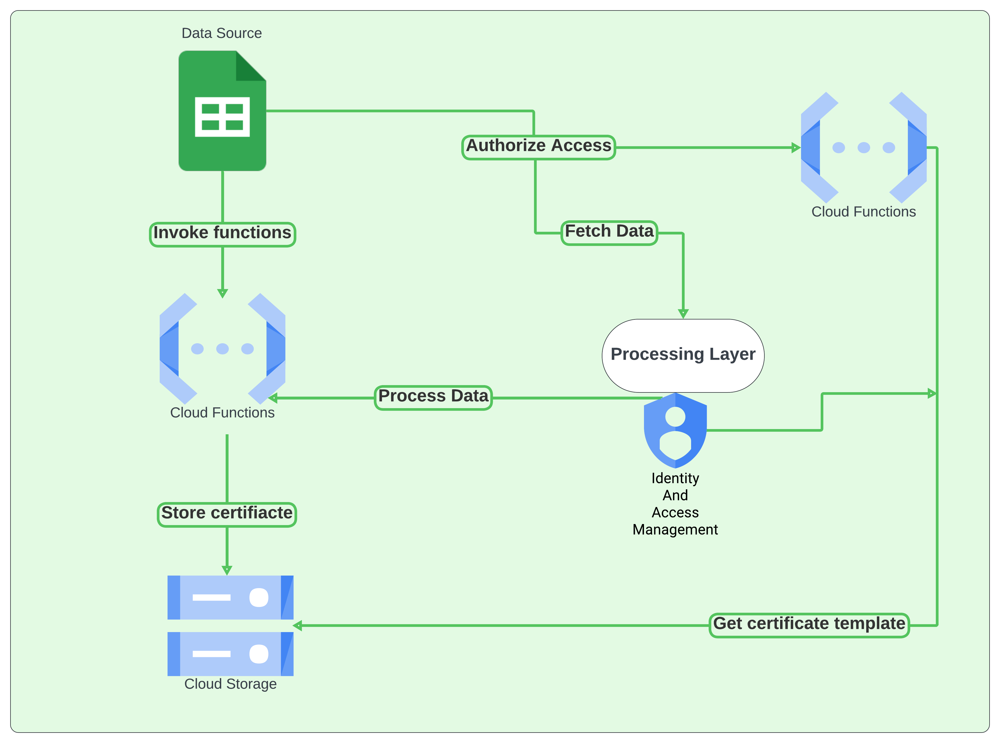
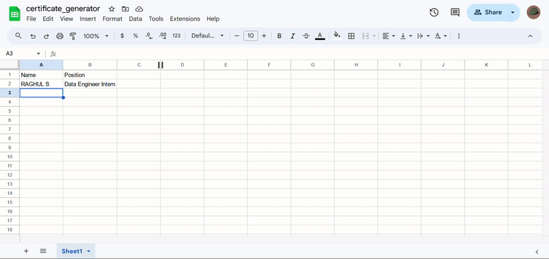

# Automated Certificate Generator

### A cloud-based certificate generation system using Google Sheets, Google Cloud Functions, and Google Cloud Storage.

## Overview
CertificateGenCloud is an automated system designed to generate professional certificates based on data from Google Sheets. The project leverages Google Cloud Functions for processing, and Google Cloud Storage for storing the generated certificates.

  

The architecture is designed as follows:
1. **Data Source**: Google Sheets is used to store participant data including names and positions.
2. **Identity and Access Management (IAM)**: Controls access to Google Cloud resources.
3. **Processing Layer**: Google Cloud Functions are responsible for reading the data, processing it, and generating certificates.
4. **Storage Layer**: Generated certificates are stored in Google Cloud Storage for easy access and retrieval.

## Project Demo

  

## Features
- **Automated Certificate Generation**: Automatically generate certificates based on entries in Google Sheets.
- **Cloud-Based Processing**: Uses Google Cloud Functions for scalable processing.
- **Secure Storage**: Certificates are securely stored in Google Cloud Storage.
- **Customizable Templates**: Easily swap out certificate templates as needed.

## Conclusion

The Automated Certificate Generator project is a robust, scalable, and efficient solution for automating the generation of certificates based on Google Sheets data. By leveraging Google Cloud Functions and Google Cloud Storage, the system ensures seamless processing and secure storage, making it ideal for educational institutions, event organizers, and businesses needing automated certificate generation.

With the added capability of generating certificates that include both names and positions, this project demonstrates a practical application of cloud computing services in streamlining administrative tasks. 

Thank you for exploring this project. We hope it serves your needs well and inspires further innovations in cloud-based solutions.

